# 个人 AI 工作台：团队主管视角体验审计

审计日期：2026-09-08  
审计范围：今日指挥台、行动中心、团队、成员下钻、项目、日历、汇报、DWS Agent、设置  
核心用户目标：主管在 5 分钟内判断“今天先做什么、哪里有风险、找谁推进、是否已经闭环”。

## 总体结论

系统已经完成了“跨来源信息聚合”的骨架，页面风格统一，日期和同步状态也比较清楚。但它更像一个管理信息看板，还没有成为主管真正依赖的“管理闭环工具”。最大的缺口不是再增加一个数据源，而是把异常、责任人、动作、截止时间、跟进记录、完成证据连成一条链。

当前成熟度判断：

- 信息汇总：较好
- 异常发现：一般
- 决策支持：一般偏弱
- 推进协作：偏弱
- 完成验证与复盘：偏弱

## 审计步骤

### 1. 今日指挥台 — 一般

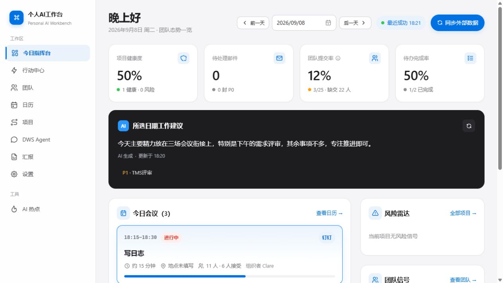

优点：核心指标、会议、风险、团队信号集中在首屏；日期与最近同步时间明确。

问题：指标彼此缺少因果关系。主管看到“提交率 12%”“待办完成率 50%”，但不知道哪些人、哪些事项影响最大，也不能直接催办或分派。AI 建议较泛，缺少依据、影响和下一步按钮。项目健康度 50% 与“1 健康、0 风险”的关系不直观，容易削弱信任。

### 2. 行动中心 — 一般偏弱

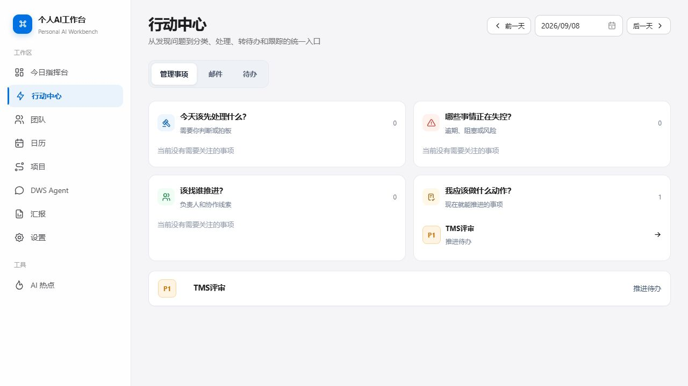

优点：“主管四问”符合主管思维方式，管理事项、邮件、待办的归并方向正确。

问题：四问之间存在内容重复，同一个 TMS 评审既出现在“我应该做什么动作”，又在下方单列。零状态占用大量空间；缺少责任人、截止时间、来源、影响范围和最近进展。最关键的是，页面没有把“查看”推进到“指派、催办、记录决策、设置复查时间”。

### 3. 团队态势 — 一般偏弱

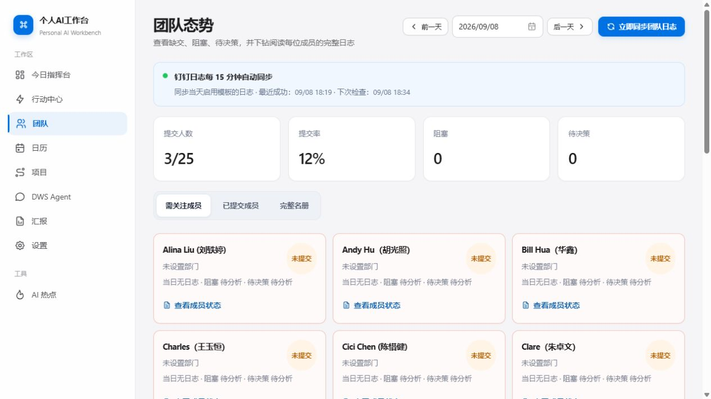

优点：提交率、阻塞、待决策与成员下钻逻辑清楚。

问题：25 人名册以同质卡片铺开，信息密度低，找人效率差；没有搜索、部门分组、排序、连续缺交、趋势和负载对比。大量“未设置部门”说明基础数据质量没有被当作问题处理。未提交成员只能查看，不能一键提醒、批量催交或排除请假/出差人员。

### 4. 成员下钻 — 较弱

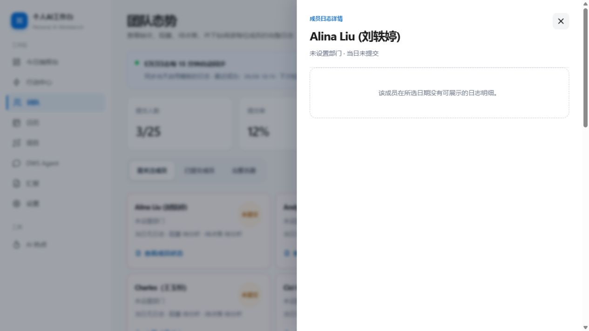

问题：未提交时抽屉几乎为空，主管没有可继续执行的动作。理想状态应给出最后提交时间、连续缺交天数、今日状态、关联项目、提醒记录，以及“提醒本人 / 标记请假 / 暂不跟进”等动作。空抽屉让一次点击变成无效操作。

### 5. 项目时间线 — 一般偏弱

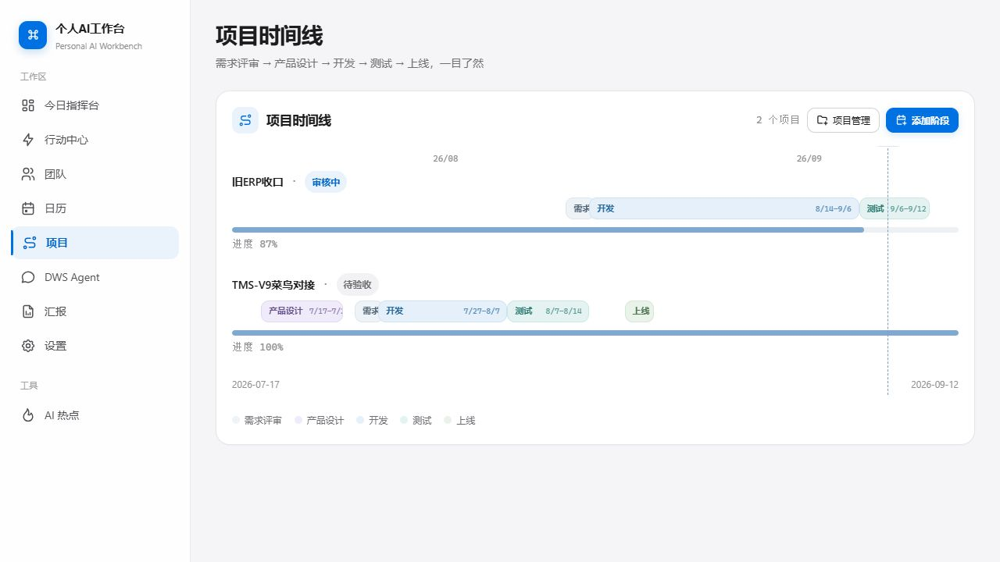

优点：阶段、时间跨度和当前日期一眼可见。

问题：时间线更像展示图，而不是管理界面。缺少项目负责人、里程碑、依赖、延期天数、风险、下一步动作和更新时间。阶段标签在窄区间发生拥挤或截断。进度 100% 的项目仍显示“待验收”，但没有解释“进度”和“状态”的区别，容易造成数据口径冲突。

### 6. 汇报 — 一般偏弱

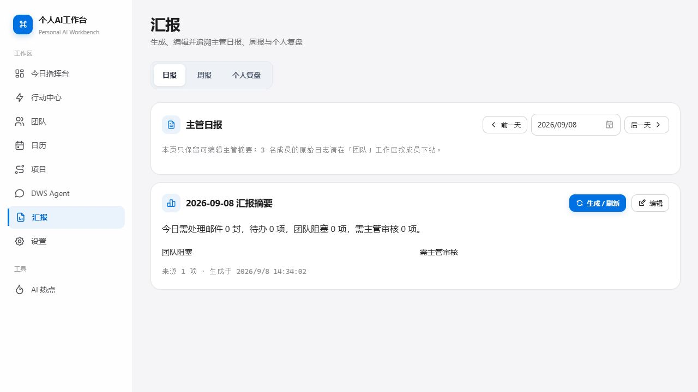

优点：日报、周报、个人复盘被集中到一个工作区，并支持生成和编辑。

问题：主管日报过于像一句统计摘要，缺少“成果、风险、需协助、明日计划、关键决策”结构。看不到发布对象、发送状态、版本差异、引用来源明细和修改记录，也没有明确的复制、导出或发送链路。当前价值更像草稿卡片，而不是汇报工作流。

### 7. 日历 — 较好

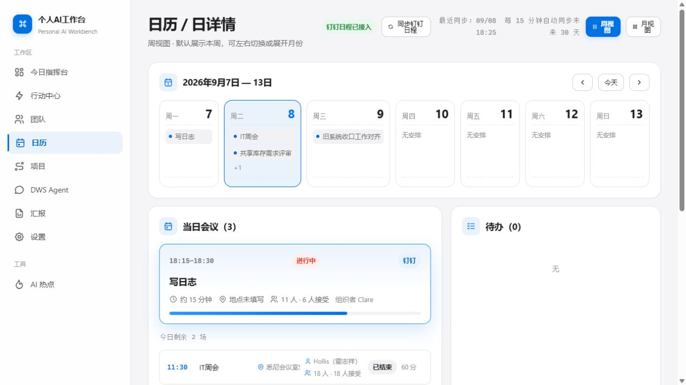

优点：周视图、日详情、会议、待办、邮件和团队日志形成了较好的日期上下文，是目前最接近主管工作场景的页面。

问题：仍缺少会议前准备、会后结论、行动项和责任人的闭环；看不到会议冲突、无缓冲连续会议、团队共同空闲和个人专注时间。周卡片里较长标题会被压缩，信息可读性一般。

### 8. DWS Agent — 较弱

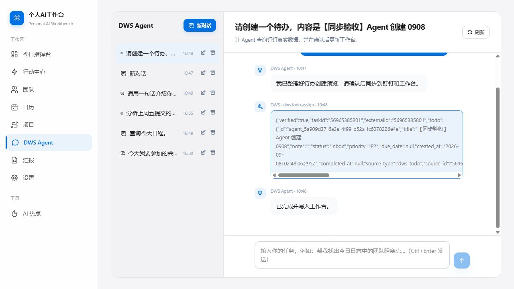

优点：对写操作设置确认步骤是正确的安全设计；会话历史也便于追溯。

问题：工具结果直接展示原始 JSON、内部字段和横向滚动条，对主管几乎不可读，也让“已完成”缺少可信的业务回执。应改为结果卡片，例如“已创建待办 / 负责人 / 截止日期 / 同步状态 / 打开待办”。“DWS Agent”也是技术命名，用户不知道它与行动中心的分工。缺少可点击的常用任务和能力边界说明。

### 9. 邮件处理 — 一般

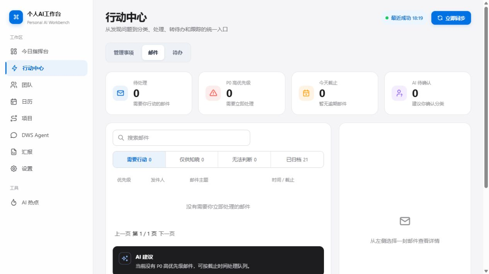

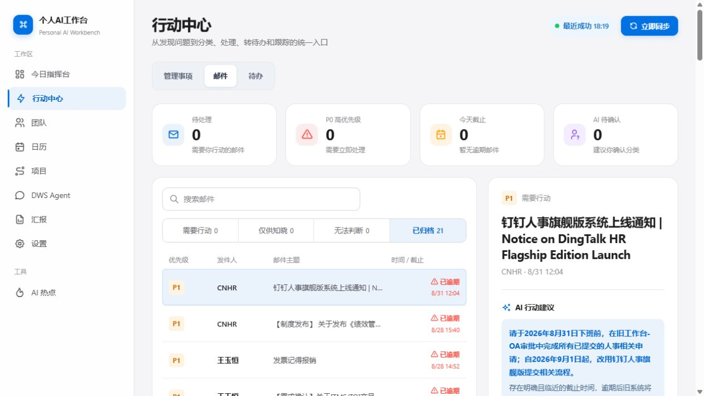

优点：行动、知晓、无法判断、归档的分类很实用；列表与详情的布局适合连续处理。

问题：空状态仍保留大面积详情空白，浪费首屏；归档邮件仍显示“已逾期”和强行动建议，关闭状态与风险状态互相冲突。详情直接铺陈超长邮件正文，关键信息被淹没。缺少“为什么这样分类”的可解释性、批量处理、稍后提醒、委派、回复状态和从邮件到项目/决策的关联。

### 10. 待办 — 较弱

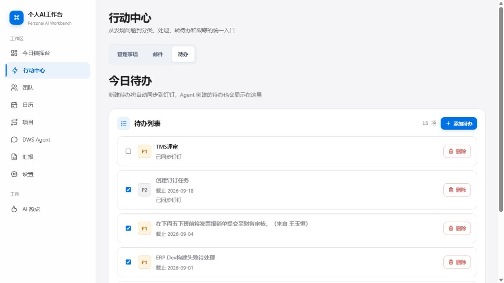

问题：“今日待办”同时展示已完成和历史逾期事项，且没有未完成、已完成、逾期的清晰分区。列表排序对主管不友好，未来截止或已完成项目可能排在更紧急项目之前。缺少负责人、项目、来源、创建时间、重复任务、提醒、筛选和批量操作。勾选框与删除按钮缺少具体事项名称，辅助技术用户很难判断正在操作哪一条。

### 11. 设置与接入 — 一般偏弱

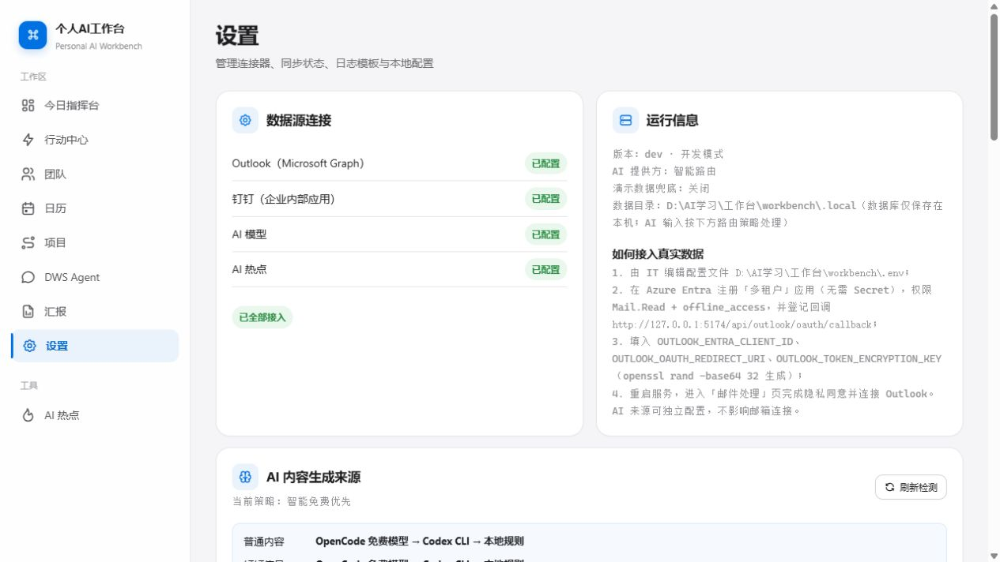

优点：数据源状态、最近同步、下一次同步与隐私边界说明比较完整。

问题：页面混合了业务设置、开发运行信息、AI 路由、隐私策略、60 个群配置和同步诊断，认知负担很高。真实数据接入仍要求 IT 手工编辑配置文件、生成密钥并重启服务，不适合普通主管。缺少配置向导、连接测试、权限解释、故障修复建议和业务设置/技术诊断的分层。

## 最高优先级改进

### P0：先补“管理闭环”，不要先扩更多信息源

为每个风险或事项统一增加：来源、责任人、截止时间、影响、下一步动作、跟进时间、完成证据。支持从指挥台、团队和邮件直接创建/指派待办、催办、记录决策，并能回到原事项查看进展。

### P0：修正状态与口径冲突

重点处理项目“100% 但待验收”、归档邮件仍“已逾期”、已完成待办仍混在“今日待办”、项目健康度与风险数量不匹配等问题。所有指标应可点开解释计算规则和明细。

### P1：把团队页变成“主管跟进台”

增加搜索、部门分组、连续缺交、趋势、请假排除、批量提醒与提醒记录；成员详情应显示工作重点、卡点、需决策事项、关联项目和最近跟进。

### P1：把 Agent 输出改成业务回执

隐藏原始 JSON，用人能读懂的卡片展示动作结果，并提供“打开待办 / 查看日程 / 撤回或修正”入口。增加常用任务快捷入口和能力边界。

### P1：让项目管理可预测

加入里程碑、负责人、依赖、延期、风险、变更记录和周趋势；让项目状态不仅反映阶段是否结束，也反映验收、阻塞和剩余工作。

### P2：完善汇报发布链路

日报/周报支持模板、引用来源、版本对比、复制/导出/发送、收件人和发送状态。AI 生成内容应能回溯到原始邮件、日志或项目事项。

### P2：提供主动提醒与个人化

主管不应每天主动打开所有页面。应提供可配置的摘要与提醒：P0 邮件、连续缺交、临近里程碑、会议前准备、待决策事项和同步失败；同时支持“只在有变化时提醒”。

## 还缺失的关键功能

- 全局搜索与跨对象关联：人、邮件、会议、项目、待办、决策互相跳转。
- 决策台账：决定了什么、谁提出、影响哪些项目、何时复查。
- 催办与跟进记录：提醒过谁、何时提醒、是否回复、下次何时跟进。
- 团队工作负载与容量：会议量、待办量、项目占用、请假与空闲情况。
- 会议闭环：会前材料、议题、结论、行动项、负责人和截止时间。
- 数据可信度：指标口径、数据更新时间、数据缺失提示、异常数据修复入口。
- 个性化：首页模块排序、关注项目/成员、提醒阈值、主管偏好的日报模板。
- 权限与隐私可视化：哪些内容被采集、发送给哪个 AI、保留多久、如何清理。

## 可访问性风险与证据限制

- 待办复选框在可访问性树中只有 0/1，没有事项名称；多个删除按钮都只叫“删除”。
- 团队成员的多个按钮都叫“查看成员状态”，缺少成员名上下文。
- 多处浅灰辅助文字和淡色状态标签存在对比度风险，需要实际测量确认。
- 页签使用普通按钮表达，截图和可访问性树中未看到明确的选中状态语义。
- 成员详情弹层具有对话框语义和明确关闭按钮，这是可访问性上的优点。
- 本次仅在桌面视口检查；未完成键盘全流程、屏幕阅读器、200% 缩放、窄屏响应式和网络失败状态测试，因此不能据此判断完整 WCAG 合规性。
