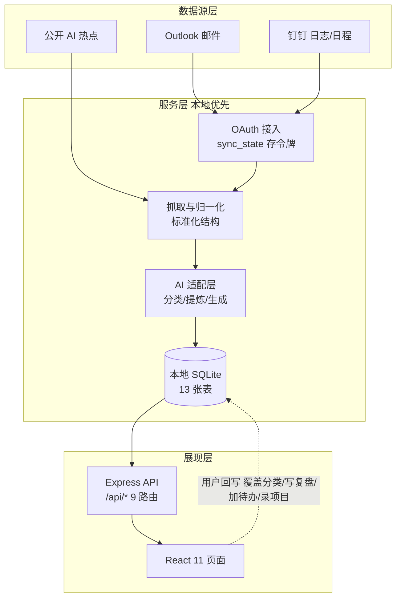
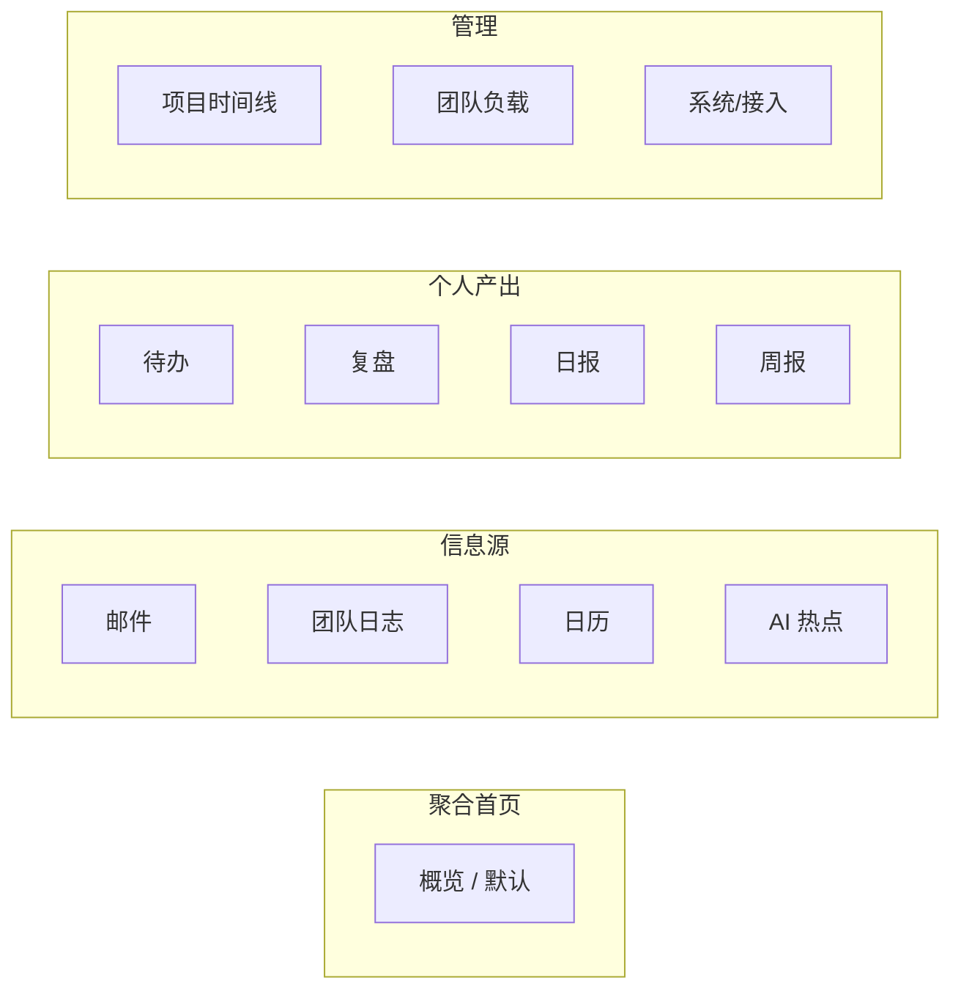

# 团队每日工作台 (Team Daily Workbench)

面向**团队主管**的本地优先 Web / 桌面工作台。把 Outlook 邮件、钉钉日志与日程聚合到一处，并用 AI 做分类与分析，配合每日/周报、待办、复盘、日历与项目时间线。

## 功能

- **概览面板**：一打开即看到当日待处理邮件、会议、团队卡点、未提交日志。
- **邮件处理**：Outlook 邮件经 AI 标记「需处理 / 无需处理」，可手动覆盖。
- **团队日志**：拉取钉钉成员日志，AI 提炼阻塞点与待审核要点，区分已提交/未提交，支持历史日期查看。
- **日历 / 日详情**：月视图，点击任意一天聚合当日邮件、待办、会议、日志与复盘。
- **今日待办**：手动添加个人任务，支持状态/优先级/截止日期。
- **今日复盘**：记录所做事、所学、所错与状态，形成成长复盘。
- **日报（独立页）**：每日基于邮件/待办/团队日志自动生成，可按日期回溯（前一天/后一天）、手动编辑小结；详见「页面地图」中的 `/daily`。
- **周报**：每周基于日报汇总生成，全部持久化于本地 SQLite，可回溯；单日详情见「日报」页。
- **AI 热点**：集成公开 AI HOT 接口（多源信源，今日必看 / 可浏览分层）。
- **项目时间线**：手动录入项目的「需求评审 → 产品设计 → 开发 → 测试 → 上线」阶段，渲染为 roadmap。
- **团队负载**：按成员聚合当日提交、阻塞、待审，算出「负载指数」并标出过载人员；指标定义见下方「团队负载定义」。
- **系统 / 接入**：Outlook / 钉钉连接管理与 AI 密钥配置。

## 数据流架构



> 未配置任何外部服务时，自动注入**合成演示数据**（seedDemoIfEmpty），界面可完整跑通。邮件正文仅在用户授权后送 AI 且不落库原文。

## 页面地图

11 个页面按职责分 4 组（侧边栏顺序即下方排列）：



| 页面 | 路由 | 主要读表 | 主要写表 |
| --- | --- | --- | --- |
| 概览 | `/` | emails / calendars / dingtalk_reports / todos（聚合） | — |
| 邮件 | `/emails` | emails | email_flags（人工覆盖分类） |
| 团队日志 | `/team` | dingtalk_members / dingtalk_reports | AI 提炼结果 |
| 日历 | `/calendar` | calendars（跨表聚合） | — |
| 待办 | `/todos` | todos | todos |
| 复盘 | `/review` | daily_reviews | daily_reviews |
| 日报 | `/daily` | daily_reports | daily_reports（编辑小结） |
| 周报 | `/weekly` | daily_reports / weekly_reports | 两表（AI 生成回写） |
| AI 热点 | `/ai-hot` | ai_hot_cache | ai_hot_cache |
| 项目时间线 | `/projects` | projects / project_phases | 两表 |
| 团队负载 | `/team-load` | dingtalk_members + dingtalk_reports（聚合） | — |
| 系统/接入 | `/system` | sync_state | sync_state / 配置 |

## 团队负载定义

团队负载页（`/team-load`）用于一眼看清「谁在做什么、谁卡住了」。核心是一个可解释的**负载指数**：

```
负载指数 = 阻塞 × 2 + 待审 × 1 + 未提交 × 3
```

- **阻塞**：成员当日钉钉日志中被 AI 标记的卡点数（权重 2）。
- **待审**：需主管审核的要点数（权重 1）。
- **未提交**：当日未上报日志（罚分 3，避免漏报被忽略）。

**档位与颜色**

| 档位 | 负载指数 | 颜色 | 含义 |
| --- | --- | --- | --- |
| 正常 | 0 – 3 | 绿 | 状态良好 |
| 偏高 | 4 – 5 | 琥珀 | 指标卡「高负载」阈值 = ≥4 |
| 过载 | ≥ 6 | 红 | 需重点关注 |

**数据来源**：钉钉成员（`dingtalk_members`，仅非管理层）与日志（`dingtalk_reports`，`report_date = 当日`）。聚合由后端接口 `GET /api/team/load` 计算。

## 技术栈

- 前端：React 19 + Vite 6 + React Router 7
- 后端：Node + Express，better-sqlite3 本地存储
- 桌面：Electron + electron-builder（.exe / .dmg）
- AI：可插拔适配层（默认 DeepSeek，可切 OpenAI / Claude / 本地 Ollama）

## 运行

```bash
npm install
cp .env.example .env      # 按需填写 Outlook / 钉钉 / AI 密钥
npm run dev               # 前端 http://127.0.0.1:5174 + API http://127.0.0.1:8787
```

未配置任何外部服务时，自动注入**合成演示数据**，界面可完整跑通。

## 接入真实数据

1. 在 Azure Entra 注册应用（权限 `Mail.Read` + `offline_access`），回调 `http://127.0.0.1:5174/api/outlook/oauth/callback`。
2. 在钉钉开发者后台创建企业内部应用（日志 / 日程 / 通讯录权限），回调 `http://127.0.0.1:5174/oauth/dingtalk/callback`。
3. 在 `.env` 填入 `OUTLOOK_ENTRA_CLIENT_ID`（多租户公共客户端，无需 Secret，采用 PKCE）、`DINGTALK_CLIENT_ID/SECRET`、`DEEPSEEK_API_KEY`。
4. 重启，在「系统 / 接入」页点击连接并完成 OAuth 授权。

## 桌面打包

```bash
npm run electron:build   # 输出 release/ 安装包
```

## 安全说明

OAuth 令牌保存在本地 SQLite（`sync_state` 表），邮件正文仅在用户授权后发送 AI 且不落库原文。`.local/` 与 `.env` 已加入 `.gitignore`，请勿提交。
