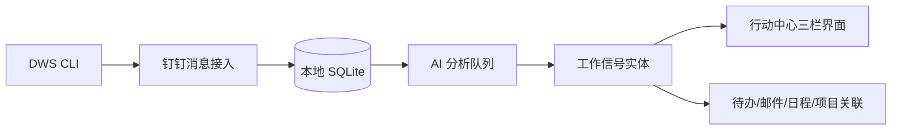

# 个人 AI 工作台

面向团队主管的本地优先 Web / Electron 工作台，聚合邮件、钉钉、日程、项目和待办，并由 AI 将信息整理成可执行的工作事项。

## 当前能力

- 行动中心：统一查看注意事项、邮件、钉钉信号和待办。
- 钉钉工作信号：DWS CLI 同步私聊及启用群的 `@我` / `@所有人` 消息。
- AI 研判：后端持久化工作信号，输出标题、结论、事实、步骤、证据和关联候选。
- 信号归并：按同一主题、项目或连续讨论归并，避免每条消息单独出现。
- 私聊规则：完整保存双向对话；仅将工作相关消息提交分析。
- 群聊规则：只有启用群中的 `@我` / `@所有人` 作为分析根消息，前后上下文仅用于判断。
- 行动确认：用户确认后才创建待办或写入关联；等待他人、忽略和完成后的事项退出默认列表。
- 消息档案：按联系人或群保存原始记录，支持搜索、上下文查看和附件手动下载。
- 保留策略：默认保留 180 天，可设置永久保留；附件默认不自动下载。
- 其他模块：Outlook 邮件、钉钉团队日志、日历、项目时间线、日报/周报、复盘和 AI 热点。

## 数据流



DWS 仅作为外部运行时使用，不随应用分发。同步首次可回溯指定窗口，常规同步每 15 分钟执行一次，并使用水位线和重叠窗口避免重复或漏消息。

## 主要接口

钉钉接口前缀为 `/api/dingtalk-chat`：

| 接口 | 用途 |
| --- | --- |
| `GET /status` | DWS 安装、登录、账号和能力状态 |
| `POST /auth/start` | 启动 DWS 登录引导 |
| `GET/PATCH /settings` | 保留策略和群启停配置 |
| `GET /signals` | 工作信号列表与分组计数 |
| `GET /signals/:id` | 信号详情、AI 研判、证据和关联 |
| `PATCH /signals/:id` | 等待、忽略等状态更新 |
| `POST /signals/:id/draft/confirm` | 确认待办草稿，按信号幂等创建 |
| `GET /conversations` | 消息档案会话目录 |
| `GET /messages` | 原始消息搜索和分页 |

统一同步接口：`GET /api/sync/status`、`POST /api/sync/run`。手动回溯时可在请求体传入 `dingtalkChatDays`，例如 `7` 表示最近 7 天；常规调用不传该字段，继续使用增量同步。

## 技术栈

- 前端：React 19、Vite 6、React Router 7、Tabler Icons
- 后端：Node.js、Express、better-sqlite3
- 桌面：Electron、electron-builder
- AI：智能路由，支持 OpenCode 免费模型、Codex CLI、本地规则及可配置 API 适配器
- 数据：本地 SQLite；`.local/` 和 `.env` 不提交到版本库

## 本地运行

```bash
npm install
cp .env.example .env
npm run dev
```

- 前端：`http://127.0.0.1:5174`
- API：`http://127.0.0.1:8787`

仅启动后端：`npm run server`

## 真实钉钉数据

1. 安装并登录 DWS CLI，确保 `dws` 在 PATH 中。
2. 在设置页检查 DWS 状态并启用需要接入的群聊。
3. 点击行动中心同步，或调用 `POST /api/sync/run` 并选择 `dingtalk_chat`。
4. 首次同步完成后，AI 仅分析符合规则的新入站根消息；低置信度或 AI 不可用时只归档，不自动创建待办。

系统不会向前端返回 DWS 令牌、认证文件或其他凭据。

## 验证与构建

```bash
npm test
npm run build
```

测试覆盖消息幂等、私聊双向保存、群 `@我` / `@所有人`、上下文窗口、能力降级、保留期清理、工作信号归并和待办幂等。

## 打包

```bash
npm run web:installer
npm run electron:build
```

Windows 网页安装包输出到 `release-web/`，Electron 安装包输出到 `release/`。
